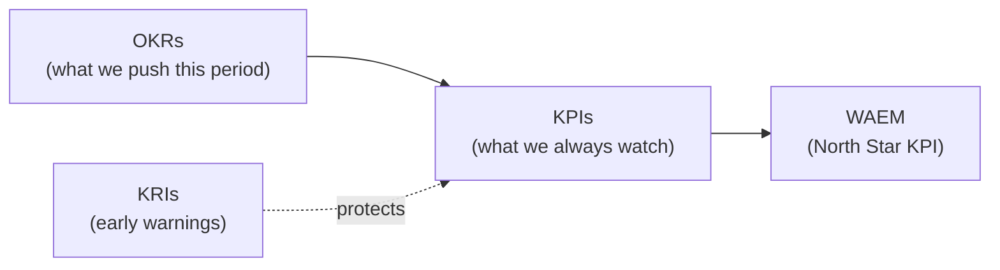

Welcome. Two things this doc gives you: (1) what to do each day, and (2) the three metric types you'll live in — OKR, KPI, KRI — in plain English with Curious Geeks examples.

> **The one thing to remember:** your job is to grow **WAEM** — Weekly Active Engaged Members (members who liked, reviewed, or commented in the last 7 days). Every duty below exists to move that number.

---

## Part 1 — Your duties

### Daily (≈ 60–90 min total)

1. **Check the dashboard** (5 min) — WAEM + the 4 input metrics + the KRIs (see Part 2). Note which one is lagging.
2. **Keep the room alive** (20 min) — make sure every new product submission gets a real, thoughtful review or reply. Early on, this is partly you. A submission that gets ignored is a member lost.
3. **Distribute** (20 min) — post or reframe one piece of content into your chosen channel (Reddit / Discord / Indie Hackers / LinkedIn). One channel, done well, beats five half-hearted.
4. **Recruit** (15 min) — DM 1–2 builders who'd fit, or reply to interested ones. Supply (products) comes from here.
5. **Log one learning** (5 min) — what worked, what flopped. Future-you needs this.

### Weekly

1. **Publish the week's post** (from the content calendar) and reframe it into 3–4 channel-native versions.
2. **Run the metric review** — find the single lagging input, run _one_ experiment against it.
3. **Send the digest** (once live) — the weekly email that pulls members back.

### Monthly

1. **OKR readout** — where each Key Result stands vs target.
2. **Recalibrate** — adjust targets or focus based on real data.

> [!tip] **Priority order when time is short:** keep the room alive (2) > recruit (4) > distribute (3). A dead room can't be marketed.

---

## Part 2 — OKR, KPI, KRI explained

These are **not** alternatives. They work together: KPIs are what you watch always, OKRs are what you push this period, KRIs are what warn you before something breaks.

### OKR — Objective & Key Results
**What it is:** an ambitious, time-boxed goal (the Objective) plus 3 measurable results that prove you hit it (the Key Results). Set per period (here, 6 months). Aim for ~70% achievable — if you always hit 100%, you aimed too low.
**Use it for:** focusing the team on what to _change_ this period.
**Curious Geeks example:**
> **Objective:** Make the room feel alive. **KR 1:** WAEM ≥ 15% of members **KR 2:** 30-day return rate ≥ 40% **KR 3:** 100 reviews + 50 comments posted
### KPI — Key Performance Indicator

**What it is:** a core metric you track _continuously_, over the long run — not tied to one goal period. Some KPIs become Key Results when you're actively pushing them.
**Use it for:** monitoring ongoing health.
**Curious Geeks KPIs:**
- **WAEM** (this is the headline KPI — your North Star)
- Weekly signups
- Return rate
- Active products listed
- Email list size & open rate
> **OKR vs KPI in one line:** a KPI is the speedometer you always watch; an OKR is "get to 100 km/h by Friday." Same metric, different job.
### KRI — Key Risk Indicator
**What it is:** an early-warning metric. It moves _before_ a KPI tanks, so you can act early. KRIs usually have a threshold — cross it, and something's going wrong.
**Use it for:** protecting quality while you chase growth. (These are the "guardrails" in the OKR doc.)
**Curious Geeks KRIs (with thresholds):**

| KRI                        | Warning threshold                       | What it warns about                                    |
| -------------------------- | --------------------------------------- | ------------------------------------------------------ |
| Review quality             | < 60% of reviews have written substance | The feedback culture is decaying — the core value prop |
| Spam / low-quality signups | > 5% of new members                     | The gate is failing; room quality at risk              |
| First-load reliability     | any cold-start 500 s                    | New visitors hitting errors = permanent loss           |
| Return rate trend          | dropping week-over-week                 | Retention breaking _before_ WAEM shows it              |

---

## Part 3 — How they connect (the picture)

- **WAEM** is the North Star — the single most important KPI.
- **OKRs** set this period's targets for moving WAEM and its inputs.
- **KPIs** are the dials you monitor continuously.
- **KRIs** warn you when growth is about to cost you quality — so you fix it before a KPI drops.

---

## Part 4 — Your first two weeks

1. Get analytics + dashboard live (you can't manage what you can't see).
2. Lock positioning: the one-line value prop + 3 pillars, applied everywhere.
3. Wire email capture.
4. Recruit the first 10 products personally.
5. Ship the first post from the calendar.

---

_PMM playbook for [Curious Geeks](https://claude.ai/). Pairs with [[OKRs-Marketing-H2-2026]] and [[NorthStar-WAEM-Calculation-and-PMM-Roles]]._